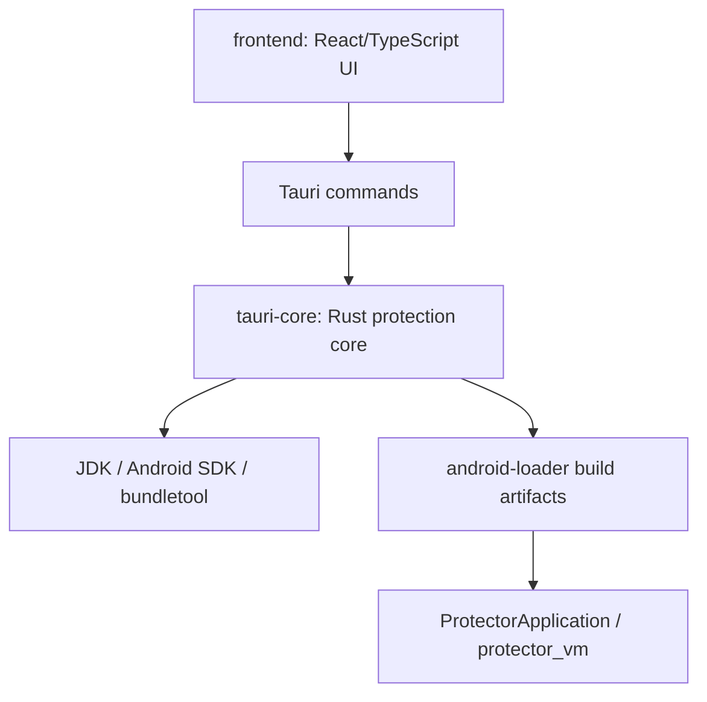

# 模块依赖关系

## 依赖图

## 模块详情

| 模块 | 路径 | 源文件数 | 主要依赖 | 职责 |
|---|---|---:|---|---|
| frontend | `src/` | 3 | React, Tauri API, dialog plugin, lucide-react | 桌面工作台 UI、Tauri command 调用、任务状态展示 |
| tauri-core | `src-tauri/src/` | 13 | tauri, zip, aes-gcm, serde, regex, sha2, uuid | APK/AAB 扫描、DEX/VMP、payload、签名、任务、设置 |
| android-loader | `loader-android/protector-loader/` | 3 | Android Gradle plugin, CMake, log, JNI | 运行时 loader、原 Application 委托、native VM 骨架 |

## 依赖规则

- `frontend` 只依赖 Tauri IPC，不直接读写 APK/AAB、keystore、工具链或本地设置文件。
- `tauri-core` 是安全与文件处理边界，负责外部命令、签名、ZIP 重写和 payload 加密。
- `android-loader` 是目标 APK/AAB 内运行时代码，只能通过构建产物被 `tauri-core` 注入或引用。
- `tools/` 是外部工具布局，不是业务模块；新增工具必须同步 `tools/README.md` 和 `toolchain.rs` 探测逻辑。

## 循环依赖检查

未发现代码级循环依赖。需要防止的未来违规：

- `android-loader` 反向读取 `src-tauri` 配置。
- `tauri-core` 依赖 React 类型或 UI 文案。
- 前端绕过 `commands.rs` 直接处理签名密码或 shell 命令。
