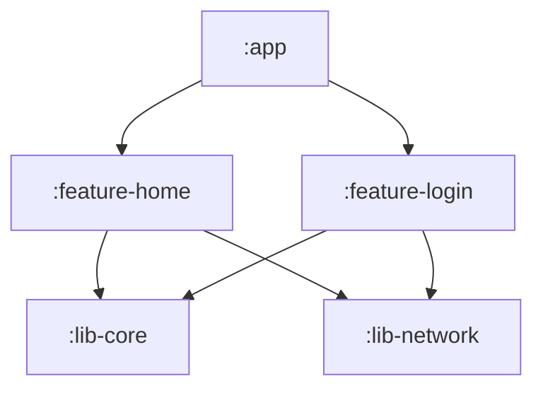

# Project Initialization Guide — 项目AI辅助体系初始化指南

> **重要说明**: 本文件是AI执行初始化的操作手册，不是给人类阅读的文档。
> 
> **触发方式**:
> - 方式1: 用户说"按project_initialization skill初始化本项目"
> - 方式2: 用户说"阅读AI_INIT_GUIDE.md并执行"
> - 方式3: AI检测到{{DIR}}/rules/目录下文件为空或包含占位符时主动建议

## Phase 0: 检测当前状态

首先检查项目当前状态：

1. **读取配置文件**
   - 检查 `{{DIR}}/scripts/gen_references.py` 是否存在
   - 检查 `{{DIR}}/references/_scan.json` 是否已生成
   - 判断是"首次初始化"还是"增量更新"

2. **检查模板完整性**
   - 如果检测到 `project_rule.md` 中仍有 "Define XXX here" 等占位符
   - 说明之前未完成初始化，应重新执行完整流程

3. **确认CodeGraph状态**
   - 运行 `codegraph --version` (3秒超时)
   - 如果未安装，执行 Phase 0.4 询问用户是否安装
   - 记录结果用于后续决策

输出检测结果：
```
📋 初始化状态检测:
- gen_references.py: [存在/缺失]
- _scan.json: [已生成/未生成]
- CodeGraph CLI: [已安装/未安装]
- 初始化类型: [首次初始化/增量更新]
```

## Phase 0.4: CodeGraph 安装提示（仅当未安装时执行）

如果Phase 0.3检测到CodeGraph未安装，询问用户：

```
⚙️  检测到 CodeGraph CLI 未安装

CodeGraph 是一个代码关系图工具，可为 AI 提供项目结构探索能力（类/方法/符号搜索）。
安装后可减少约 90% 的 AI 工具调用，使 references/ 目录采用轻量模式。

是否现在安装 CodeGraph？
  1. ✅ 是，安装并配置（推荐）
  2. ❌ 否，跳过（将使用完整模式）

选择 1 → 执行 Phase 0.4.1 安装流程
选择 2 → 设置 HAS_CODEGRAPH = false，references/ 采用完整模式
```

### Phase 0.4.1: CodeGraph 安装流程

用户选择安装后，执行以下步骤：

```
Step 1: 安装 CodeGraph CLI
  执行: npx @colbymchenry/codegraph
  
Step 2: 验证安装
  执行: codegraph --version
  成功 → HAS_CODEGRAPH = true
  失败 → 显示错误信息，询问用户是否继续（降级为完整模式）
  
Step 3: 初始化 CodeGraph（必须执行）
  说明: CodeGraph 必须在项目中建立索引才能使用
  执行: codegraph init
  等待初始化完成...
  
  如果初始化成功:
    → CodeGraph 已就绪，使用轻量模式
    → 继续后续流程
  
  如果初始化失败:
    → 显示错误信息
    → 询问用户: "CodeGraph 初始化失败，是否降级为完整模式？"
      - 是 → HAS_CODEGRAPH = false，使用完整模式
      - 否 → 中止初始化流程，让用户手动解决问题
```

安装成功后设置 `HAS_CODEGRAPH = true`，影响后续行为：
- `project_rule.md` §1 行为准则使用 CodeGraph 版本
- `{{ENTRY}}` 入口文件追加 CodeGraph 集成说明
- `gen_references.py` 使用 `--lightweight` 标志
- `references/` 采用轻量模式

安装失败不阻塞流程，降级为完整模式继续。

## Phase 1: 项目深度分析

### 1.1 运行结构扫描器（带 CodeGraph 验证）

**关键步骤**: 在执行扫描前，必须验证 CodeGraph 是否真正可用

```
如果 HAS_CODEGRAPH = true:
  Step A: 验证 CodeGraph 可用性
    执行: codegraph explore "test" --limit 1 2>/dev/null
    
    如果成功:
      → CodeGraph 可用 ✅
      执行: python {{DIR}}/scripts/gen_references.py --lightweight
      
    如果失败:
      → CodeGraph 不可用 ️
      自动降级: HAS_CODEGRAPH = false
      提示: "⚠️ CodeGraph 未正确初始化或不可用，已降级为完整模式"
      执行: python {{DIR}}/scripts/gen_references.py
      
如果 HAS_CODEGRAPH = false:
  直接执行: python {{DIR}}/scripts/gen_references.py
```

**降级原因可能是**:
- 用户跳过了 `codegraph init`
- CodeGraph 索引损坏
- 项目结构发生变化需要重新索引

**降级后的行为**:
- `_scan.json` 将包含完整文件列表和目录树
- AI 可以通过文件列表直接定位源码
- 不影响初始化流程继续进行

这将生成 `{{DIR}}/references/_scan.json`，包含：
- 模块列表和依赖关系
- 文件树结构（非轻量模式）
- 资源文件清单（非轻量模式）
- 构建配置信息

### 1.2 解析扫描结果

读取 `_scan.json` 并提取关键信息：

```javascript
// 伪代码示例
const scanData = JSON.parse(readFile('{{DIR}}/references/_scan.json'));
const modules = scanData.modules;
const dependencies = scanData.dependencies;
const fileTree = scanData.fileTree; // 仅在非轻量模式下存在
```

**需要收集的信息**:
- 所有模块名称及其路径
- 模块间的依赖关系图
- 主要源代码目录位置
- 构建系统配置（Gradle/Xcode/Hvigor等）
- 测试框架配置

### 1.3 源码深度扫描

对每个核心模块执行源码分析：

**对于每个模块**:
1. 读取模块下的所有源文件（.kt/.java/.swift/.dart/.ts等）
2. 识别以下内容：
   - 核心类和接口
   - 公共API暴露点
   - 路由注解（如@Route）
   - 数据模型定义
   - 设计模式使用情况

**示例扫描逻辑**:
```
for module in modules:
    source_files = find_source_files(module.path)
    for file in source_files[:10]:  # 限制每个模块读取的文件数
        content = read_file(file)
        extract:
            - class/interface definitions
            - public methods
            - annotations/decorators
            - import/dependency statements
```

### 1.4 架构推断

基于扫描结果推断实际架构：

**依赖方向分析**:
- 从build.gradle/Podfile/hvigorfile等构建文件中提取真实依赖声明
- 验证是否存在循环依赖
- 识别分层架构（App → Feature → Common → Base）

**命名约定提取**:
- 统计类名模式（Activity/ViewController/Page等后缀使用率）
- 分析资源文件命名规律
- 提取包名/命名空间规范

**通信机制识别**:
- 检测ARouter/React Navigation/GoRouter等路由框架使用
- 识别EventBus/NotificationCenter/Provider等事件机制
- 发现Service/Repository等数据层模式

输出分析摘要：
```
🔍 项目架构分析完成:
- 发现 X 个模块: [模块列表]
- 依赖方向: App → Feature → Lib (单向)
- 路由框架: ARouter (检测到 @Route 注解)
- 状态管理: LiveData + ViewModel
- 命名规范: Activity以Activity结尾, 资源以模块名前缀
```

## Phase 2: 交互式配置（精简版）

向用户提出7-11个关键问题，收集项目特有约束：

### Q1: 项目身份
```
请提供以下信息：
1. 项目名称: [从package.json/build.gradle自动检测，让用户确认]
2. 项目描述: [简短描述项目用途]
3. 主包名/命名空间: [自动检测，让用户确认]
4. AI助手名称: [默认: Assistant]
```

### Q2: 构建环境
```
构建命令是什么？
1. Debug构建: [自动检测gradlew assembleDebug等，让用户确认]
2. Release构建: [自动检测gradlew assembleRelease等，让用户确认]
3. 是否有自动化测试? [是/否，检测test目录]
```

### Q3: 架构约束（基于Phase 1分析结果让用户确认）
```
根据源码分析，我检测到以下架构模式：
- 模块依赖: App → feature-* → lib-* (单向)
- 通信机制: ARouter + LiveData
- 继承体系: BaseActivity, BaseFragment

这些理解正确吗？需要调整吗？
[用户确认或修正]
```

### Q4: 禁止模式（基于源码分析提供建议）
```
我建议禁止以下模式（基于常见最佳实践）：
1. 硬编码颜色值 → 使用colors.xml
2. 直接Intent跳转 → 使用ARouter
3. 主线程网络请求 → 使用协程/RxJava
4. 非ViewBinding访问视图 → 使用ViewBinding

是否需要添加或修改？
```

### Q5: 命名规范（基于实际代码统计）
```
我检测到项目中使用的命名约定：
- Activity: 功能名+Activity (如LoginActivity) - 95%符合
- Fragment: 功能名+Fragment - 100%符合
- 资源前缀: 模块名_ (如home_btn_) - 80%符合

是否将这些作为强制规范？
```

### Q6: 触发阈值
```
审查触发阈值（使用默认值或自定义）：
1. 修改多少文件触发code_review? [默认: 2]
2. 修改多少模块触发arch-review? [默认: 3]
```

### Q7: 平台特定规则（根据平台显示不同问题）

**Android示例**:
```
Android专项配置：
1. Min SDK版本? [从build.gradle读取]
2. Target SDK版本? [从build.gradle读取]
3. 是否使用Jetpack Compose? [检测依赖]
4. NDK版本? [如果检测到NDK]
```

**iOS示例**:
```
iOS专项配置：
1. 最低iOS版本? [从Podfile读取]
2. 是否使用SwiftUI? [检测.swift文件比例]
3. 是否使用Combine? [检测import语句]
```

### Q8-N: NDK专项（仅当HAS_NDK=true时）
```
NDK/C++配置：
1. 构建系统: ndk-build 还是 CMake?
2. JNI注册方式: 动态(RegisterNatives) 还是 静态?
3. 目标ABI: armeabi-v7a, arm64-v8a, x86?
4. 安全编译选项? [-fstack-protector-all等]
```

## Phase 3: 生成定制化内容

### 3.1 生成 project_rule.md

**关键原则**: 基于Phase 1的实际分析结果填充，不使用通用占位符！

**§1 行为准则**:
```markdown
{{#if HAS_CODEGRAPH}}
- 探索代码结构时优先使用 `codegraph_explore` 工具
- `{{DIR}}/references/` 采用轻量模式，仅包含架构决策和约定
{{else}}
- 通过 `{{DIR}}/references/_scan.json` 查找文件位置和模块结构
- 参考 `{{DIR}}/references/` 中的详细文档
{{/if}}
- 修改代码前必须阅读本规则文件
- 禁止虚构不存在的类、方法或API
```

**§2 架构约束**（基于实际分析）:
```markdown
## 模块依赖规则
{{DEPENDENCY_RULES}}  ← 从build.gradle/Podfile等实际提取

示例（Android）:
- :app 模块只能依赖 :feature-* 和 :lib-* 模块
- :feature-* 模块只能依赖 :lib-* 模块
- 禁止 :lib-* 反向依赖 :feature-* 或 :app
- 禁止跨 feature 模块直接依赖（必须通过 :app 协调）
```

**§3 禁止模式表**（基于实际代码扫描）:
```markdown
| # | 禁止模式 | 应使用方式 | 原因 |
|---|---------|-----------|------|
| 1 | 硬编码颜色值 #FF0000 | @color/red 引用 | 主题适配 |
| 2 | new Intent(this, XxxActivity.class) | ARouter.getInstance().build("/xxx/xxx").navigation() | 模块解耦 |
| 3 | Thread.sleep() | Coroutine.delay() / DispatchQueue.asyncAfter | 避免阻塞 |
...（根据实际检测到的问题生成）
```

**§4 命名规范**（基于实际统计）:
```markdown
## 类命名
- Activity: {功能名}Activity (如 LoginActivity) - 已检测到{X}个符合
- Fragment: {功能名}Fragment (如 HomeFragment)
- ViewModel: {功能名}ViewModel

## 资源命名
- 布局: activity_{功能}, fragment_{功能}, item_{描述}
- Drawable: {模块}_{类型}_{描述} (如 home_icon_back)
```

**§5 平台专项规则**（调用平台插件生成）:
```javascript
// 动态导入平台特定规则
const platformVars = await getPlatformVars(detection.platform, lang);
// 插入 platformVars.PLATFORM_SPECIFIC_RULES
```

**§5.N NDK专项**（仅当HAS_NDK=true）:
```markdown
## C++ / NDK 开发规范

### JNI 安全
- 所有 GetObjectField 调用后必须检查返回值是否为NULL
- LocalRef 必须在不再使用时调用 DeleteLocalRef
- 跨线程传递 jobject 必须使用 NewGlobalRef

### 内存管理
- 使用 RAII 模式管理 C 堆内存
- malloc/free 必须成对出现，推荐使用 goto cleanup 模式
- 敏感数据使用后必须 memset 清零

### 签名一致性
- Java 层 native 方法签名必须与 C 层 JNIEXPORT 函数签名严格匹配
- 修改 Java native 方法后必须同步更新 C 层实现
```

### 3.2 生成 agents/*.md

#### arch-review.md
基于实际模块依赖生成检查规则：
```markdown
## 架构审查清单

### 模块依赖检查
- [ ] 检查是否有 :lib-core → :feature-home 的反向依赖
- [ ] 检查是否有跨 feature 的直接依赖
- [ ] 验证 build.gradle 中的 implementation/project 声明

### 禁止模式检测
搜索以下模式:
- `new Intent\(` → 应使用 ARouter
- `Color.parseColor\(#` → 应使用资源引用
- `Thread\.sleep\(` → 应使用协程

### 继承体系验证
- [ ] Activity 是否继承 BaseActivity
- [ ] Fragment 是否使用 viewLifecycleOwner
```

#### resource-sync.md
根据平台生成资源同步检查：
```markdown
## Android 资源同步检查
- [ ] res/values/strings.xml 在所有 flavor 中一致
- [ ] res/layout/ 中的布局文件有对应的 dimens
- [ ] drawable-xxhdpi 等资源在各密度目录中存在
```

#### proactive-correction.md
生成主动纠错规则：
```markdown
## 主动纠错扫描维度

### 维度1: 规则自洽性
- 检查 rules/ 下各文件是否有冲突
- 验证 conflict_resolution.md 覆盖所有场景

### 维度2: 存量代码合规性
- 扫描现有代码中的禁止模式
- 列出需要修复的文件清单

### 维度3: 实现合理性
- 检测代码异味（过长方法、过大类）
- 识别重复代码片段
```

#### cpp-memory-review.md（仅NDK项目）
直接使用模板，无需修改。

### 3.3 生成 skills/*.md

#### plan_mode/SKILL.md
基于平台生成任务模板：
```markdown
## {{PLATFORM}} 高频任务模板

### 新增页面流程
1. 在 :feature-{模块} 创建 {Name}Activity
2. 在 AndroidManifest.xml 注册 Activity
3. 添加 ARouter 注解 @Route(path="/{module}/{name}")
4. 创建对应 layout XML
5. 在 :app 模块添加导航调用

### 新增API接口
1. 在 :lib-network 定义 Retrofit Service 接口
2. 创建数据模型 data class
3. 在 Repository 中封装调用
4. 在 ViewModel 中暴露 LiveData
```

#### code_review/SKILL.md
基于平台生成审查清单：
```markdown
## ❌ 致命问题（必须修复）
{{PLATFORM_FATAL_CHECKS}}

### Android示例:
- [ ] 模块依赖方向违规（lib → feature）
- [ ] 直接使用 Intent 跳转（未用ARouter）
- [ ] 主线程网络请求
{{#if HAS_NDK}}
- [ ] JNI LocalRef 未释放
- [ ] JNI 方法签名不匹配
{{/if}}

## ⚠️ 警告（建议修复）
{{PLATFORM_WARNING_CHECKS}}

## 💡 建议（可选优化）
{{PLATFORM_SUGGESTION_CHECKS}}
```

#### performance_check/SKILL.md
**直接复制模板文件**，无需修改：
```bash
cp {{DIR}}/skills/performance_check/SKILL.md.template {{DIR}}/skills/performance_check/SKILL.md
```

该skill包含完整的性能与安全检查能力：
- 内存泄漏检测（Android/iOS/C++）
- OOM风险检测（Bitmap/集合/线程池）
- 启动速度优化（Application/首屏加载）
- ANR检测（主线程耗时操作）
- 卡顿检测（RecyclerView/动画/绘制）
- 代码安全（敏感数据/加密/权限）

### 3.4 生成 references/ 文档

**Step 1**: 脚本已生成 `_scan.json`（在Phase 1.1完成）

**Step 2**: AI逐模块生成文档

**重要**: 必须为 _scan.json 中的**所有模块**生成文档，不能遗漏！

对于每个模块，执行：
```
1. 读取 _scan.json 中该模块的结构信息
2. 逐个读取该模块的源文件（限制每个模块最多10个关键文件）
3. 基于源码理解生成 {module}.md
4. 确认文件已保存到 {{DIR}}/references/{module}.md
```

**模块列表获取**:
```
const scanData = JSON.parse(readFile('{{DIR}}/references/_scan.json'));
const allModules = scanData.modules;  // 获取所有模块

console.log(`📋 共发现 ${allModules.length} 个模块:`);
allModules.forEach((m, i) => console.log(`  ${i+1}. ${m.name}`));

// 逐个生成
for (const module of allModules) {
  console.log(`🔍 正在生成模块文档: ${module.name} (${i+1}/${allModules.length})`);
  generateModuleDoc(module);
}
```

**{module}.md 模板**:
```markdown
# {模块名}

## 模块概述
{基于源码分析的1-3句话描述，禁止写"待补充"}

## 元信息
| 项 | 值 |
|----|-----|
| 类型 | {application/library} |
| 包名 | {com.example.module} |
| 依赖 | {:lib-core, :lib-network} |
| 外部依赖 | {retrofit:2.9.0, glide:4.12.0} |
| 源文件数 | {25} |

## 目录结构
```
{模块路径}/
├── src/main/java/com/example/{module}/
│   ├── ui/
│   │   ├── {Name}Activity.kt
│   │   └── {Name}Fragment.kt
│   ├── viewModel/
│   │   └── {Name}ViewModel.kt
│   └── repository/
│       └── {Name}Repository.kt
└── src/main/res/
    ├── layout/
    └── values/
```

## 类与接口详情

### UI层（3个）

#### `{Name}Activity` [Activity]
- **继承**: BaseActivity → AppCompatActivity
- **实现**: IRefreshable
- **说明**: {从KDoc或代码逻辑推断的功能描述}
- **关键注解**: @Route(path="/{module}/{name}")
- **公共 API**:
  - `fun refreshData()` - 刷新页面数据
  - `fun navigateToDetail(id: String)` - 跳转到详情页

#### `{Name}Fragment` [Fragment]
- ...

### ViewModel层（1个）

#### `{Name}ViewModel` [ViewModel]
- **继承**: BaseViewModel
- **说明**: 管理{功能}页面的业务逻辑和数据状态
- **公共 API**:
  - `val dataState: LiveData<Result<Data>>` - 数据状态流
  - `fun loadData()` - 加载数据

### 数据层（2个）

#### `{Name}Repository` [Repository]
- ...

#### `{DataModel}` [data class]
- **字段**: id: String, name: String, timestamp: Long
- **说明**: {功能}的数据模型

## 路由表
| 路径 | 目标 | 参数 |
|------|------|------|
| /{module}/{name} | {Name}Activity | id (可选) |

## 跨模块API
该模块对外暴露的接口：
- `{Name}Repository.getData()` - 供其他模块获取数据
- `ARouter path: /{module}/{name}` - 供其他模块导航

## 设计模式与约定
- **MVVM**: Activity/Fragment → ViewModel → Repository
- **单例**: Repository 使用 object 关键字
- **观察者模式**: LiveData 通知UI更新
```

**Step 3**: 生成 dependencies.md

```markdown
# 模块依赖关系图



## 依赖详情

| 模块 | 依赖 | 类型 |
|------|------|------|
| :app | :feature-home, :feature-login | implementation |
| :feature-home | :lib-core, :lib-network | api |
| :feature-login | :lib-core, :lib-network | api |

## 循环依赖检测
✅ 未发现循环依赖

⚠️ 注意: :lib-network 不应依赖 :feature-* 模块（当前未违反）
```

**Step 4**: 生成 conventions.md

```markdown
# 编码约定

## 命名规范

### 类命名
- Activity: {功能名}Activity (如 LoginActivity)
- Fragment: {功能名}Fragment
- ViewModel: {功能名}ViewModel
- Repository: {功能名}Repository

### 资源命名
- 布局: activity_{功能}, fragment_{功能}, item_{描述}
- Drawable: {模块}_{类型}_{描述} (如 home_icon_back)
- String: {模块}_{描述} (如 home_title_welcome)

## 代码风格
- Kotlin 遵循官方代码风格
- 使用 4 空格缩进
- 最大行长度 120 字符
- 公共 API 必须有 KDoc 注释

## 架构约定
- 所有 Activity 继承 BaseActivity
- 所有 Fragment 使用 viewLifecycleOwner 观察 LiveData
- 网络请求必须在 Repository 层封装
- 禁止在 Activity/Fragment 中直接调用 Retrofit

## 测试约定
- 单元测试放在 src/test/java/ 目录
- 仪器测试放在 src/androidTest/java/ 目录
- 测试类命名: {被测类}Test
```

## Phase 4: 验证与完成

### 4.1 执行检查清单

在完成所有文件生成后，AI必须逐项检查：

```
✅ 初始化完成检查清单:

基础文件:
- [ ] {{DIR}}/CHANGELOG.md 已生成
- [ ] {{DIR}}/settings.json 已生成
- [ ] {{DIR}}/settings.local.json 已生成
- [ ] {{DIR}}/hooks/post-edit-tracker.sh 已生成
- [ ] {{DIR}}/hooks/check-review-needed.sh 已生成

规则文件:
- [ ] {{DIR}}/rules/project_rule.md 无占位符残留
- [ ] {{DIR}}/rules/conflict_resolution.md 已生成
- [ ] project_rule.md 中的依赖方向与实际build文件一致
- [ ] 禁止模式表中列出的都是项目中真实存在的问题

技能文件:
- [ ] {{DIR}}/skills/plan_mode/SKILL.md 已生成
- [ ] {{DIR}}/skills/code_review/SKILL.md 已生成
- [ ] {{DIR}}/skills/performance_check/SKILL.md 已生成（性能与安全检查）
- [ ] plan_mode 中包含平台特定的任务模板

Agent文件:
- [ ] {{DIR}}/agents/arch-review.md 已生成
- [ ] {{DIR}}/agents/resource-sync.md 已生成
- [ ] {{DIR}}/agents/proactive-correction.md 已生成
{{#if HAS_NDK}}
- [ ] {{DIR}}/agents/cpp-memory-review.md 已生成
{{/if}}

引用文档:
- [ ] {{DIR}}/references/_scan.json 已生成
- [ ] {{DIR}}/references/dependencies.md 已生成
- [ ] {{DIR}}/references/conventions.md 已生成
- [ ] **已为 _scan.json 中的所有模块生成文档**（不是只生成3个！）
- [ ] 验证: {{DIR}}/references/ 目录下的 {module}.md 文件数量 = _scan.json 中的 modules 数量
- [ ] 所有模块文档中的"模块概述"不为空
- [ ] 所有模块文档中的"元信息"表格完整填写

入口文件:
- [ ] {{ENTRY}} 已从极简版替换为完整版
- [ ] {{ENTRY}} 中所有 {{VARIABLE}} 已被替换
{{#if HAS_CODEGRAPH}}
- [ ] {{ENTRY}} 中包含 CodeGraph 使用说明
{{/if}}

质量检查:
- [ ] 所有 .md 文件中无 "{{VARIABLE}}" 占位符残留
- [ ] 所有 .sh 文件有执行权限 (chmod +x)
- [ ] CHANGELOG.md 记录了 v1.0.0 初始化
```

### 4.2 替换入口文件

将极简版的 `{{ENTRY}}` 替换为完整版（包含完整的触发策略、否定词保护、Agent委派逻辑等）。

从 `cli/templates/{{TEMPLATE_DIR}}/entry_full.md` 读取完整模板，渲染后覆盖根目录的极简版。

### 4.3 输出完成报告

```
✅ 初始化完成!

📊 生成统计:
- 规则文件: 2 个 (project_rule.md, conflict_resolution.md)
- 技能文件: 3 个 (plan_mode, code_review, performance_check)
- Agent文件: {3或4} 个 (arch-review, resource-sync, proactive-correction{{#if HAS_NDK}}, cpp-memory-review{{/if}})
- 引用文档: {N+2} 个 ({N}个模块 + dependencies.md + conventions.md)
- Hook脚本: 2 个
- 总计: {X} 个文件

🎯 关键特性:
- 已检测 {N} 个模块的依赖关系
- 已扫描 {M} 个源文件生成文档
- 已识别 {K} 个禁止模式
- {{#if HAS_CODEGRAPH}}CodeGraph 已集成，references采用轻量模式{{else}}references采用完整模式{{/if}}
{{#if HAS_NDK}}
- NDK项目已启用cpp-memory-review Agent
{{/if}}

📖 下一步:
1. 审查 {{DIR}}/rules/project_rule.md 确保规则符合项目实际
2. 根据需要调整 {{DIR}}/agents/ 中的检查规则
3. 开始使用AI辅助开发!

💡 提示:
- 修改代码前会自动加载相关规则
- 修改2+文件会触发code_review
- 修改3+模块会触发arch-review
- 可随时运行 "python {{DIR}}/scripts/gen_references.py --diff" 增量更新references
```

## 错误处理

### 场景1: gen_references.py 执行失败
```
❌ 错误: 无法生成 _scan.json
可能原因:
- Python 未安装
- 项目结构不符合预期

解决方案:
1. 安装 Python 3.6+
2. 手动检查项目结构
3. 联系开发者报告问题
```

### 场景2: 无法读取源文件
```
⚠️ 警告: 部分模块源码无法读取
跳过模块: [列表]
继续生成其他模块文档...
```

### 场景3: CodeGraph 安装失败
```
⚠️ CodeGraph 安装失败，降级为完整模式
references/ 将包含完整文件列表
如需使用CodeGraph，请手动安装: npx @colbymchenry/codegraph
```

## 附录: 平台特定变量映射

| 平台 | DEPENDENCY_RULES | COMMUNICATION_MECHANISM | FORBIDDEN_PATTERNS |
|------|------------------|------------------------|-------------------|
| Android | App → Feature → Lib | ARouter + LiveData | 硬编码颜色、直接Intent |
| iOS | Feature → Core → Foundation | Protocol + NotificationCenter | 强引用循环、主线程阻塞 |
| Flutter | Feature → Domain → Data | Provider + GoRouter | BuildContext跨异步、setState嵌套 |
| HarmonyOS | Feature HAP → Common HSP | Router + EventHub | 非@State修改、主线程耗时 |
| React Native | Screen → Component → Hook | React Navigation + Context | 桥接大数据、内联样式 |

---

**版本**: v1.0.0  
**最后更新**: 2026-05-31  
**维护者**: ai_scaffold 团队
